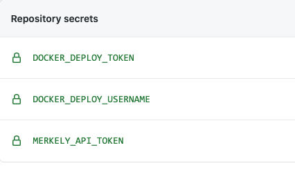

# Loan Calculator Demo

This repository provides a demo project for getting started with the [Merkely DevOps Change Management Platform](https://app.compliancedb.com).

# Getting started

Pre-requisites: You will need an account on Merkely, Dockerhub and Github.

1. Fork this repo so you can follow along.
2. Change the `owner` in [the Merkleypipe pipeline definition](Merkelypipe.json#L3) to the name of your user or team in the Merkely platform.
3. Also, change the values for `description` and `name` in [Merkelypipe.json](Merkelypipe.json). Name should not contain whitespace.
4. Add the secrets below in your github repository settings.

| SECRET NAME | NOTES |
| ----------- | ----- |
| `MERKELY_API_TOKEN` | Your Merkely api token is in [your profile page](https://app.compliancedb.com/settings/profile). |
| `DOCKERHUB_DEPLOY_USERNAME` | Your dockerhub username |
| `DOCKERHUB_REPO_OWNER` | Your repository owner in dockerhub, typically the same as `DOCKERHUB_DEPLOY_USERNAME` |
| `DOCKERHUB_DEPLOY_TOKEN` | For deploying your docker image, you will need to make a [personal access token](https://docs.docker.com/docker-hub/access-tokens/) |

For example:

# The pipelines

You will notice that this project comes with a CI/CD implementation using github actions.

There is a [master pipeline](blob/master/.github/workflows/master_pipeline.yml) following these steps:

* Build and Publish Docker Image
* Declare Merkely Pipeline
* Run test suite and log summary to Merkely
* Run security analysis and log summary to Merkely
* Run coverage and log summary to Merkely
* Deploy to STAGE and log deployment to Merkely

In addition, we have these manually triggered ci pipeline:
* [Create Approval](blob/master/.github/workflows/create_approval.yml)
* [Deploy to Production](blob/master/.github/workflows/deploy_to_production.yml)

# Things to try

1. Go to the github actions and run the master pipeline.  See the results in Merkely.

2. Check deployments are blocked without approval.
   * Run the `Deploy to Production` workflow.  It should fail because the artifact is not approved for deployment.
   * Run the `Create approval in Merkely` workflow.  It will create an approval in Merkely.
   * You can see this in the `Approvals` tab in your pipeline.  Go ahead an approve it in Merkely's UI.
   * Re-run the `Deploy to Production` workflow. This time it should succeed.

3. Extra-credit: Smuggling in security failures

