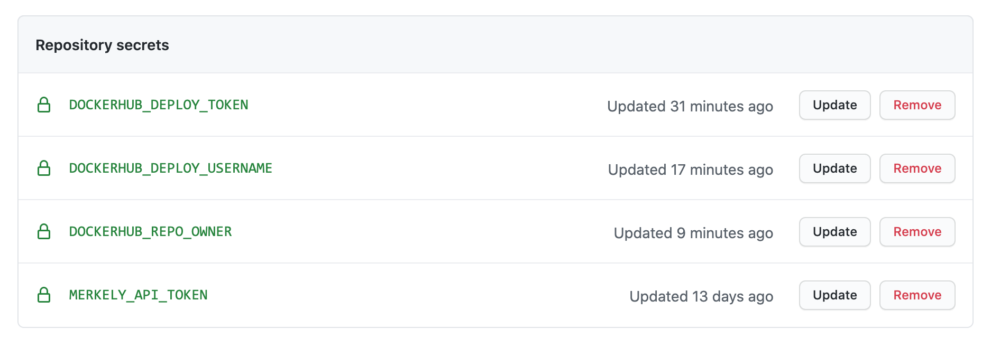

# Loan Calculator Demo

This repository provides a demo project for getting started with the [Merkely DevOps Change Management Platform](https://app.merkely.com).

# Getting started with Github Actions

Pre-requisites: You will need an account on Merkely, Dockerhub and Github.

1. Fork this repo so you can follow along.
2. Change `MERKELY_OWNER` in [env-files/github.env](env-files/github.env#L1) to the name of your user or team in the Merkely platform.
3. Choose a name for your Merkely pipeline. The name must not contain whitespace.   
4. Change `MERKELY_PIPELINE` in [env-files/github.env](env-files/github.env#L2) to the name of your pipeline. 
5. Add the secrets below in your github repository settings.

| SECRET NAME | NOTES |
| ----------- | ----- |
| `MERKELY_API_TOKEN` | Your Merkely api token is in [your profile page](https://app.merkely.com/settings/profile). |
| `DOCKERHUB_DEPLOY_USERNAME` | Your dockerhub username |
| `DOCKERHUB_REPO_OWNER` | Your repository owner in dockerhub, typically the same as `DOCKERHUB_DEPLOY_USERNAME` |
| `DOCKERHUB_DEPLOY_TOKEN` | For deploying your docker image, you will need to create a [personal access token](https://docs.docker.com/docker-hub/access-tokens/) |

For example:

# The pipelines

You will notice that this project comes with a CI/CD implementation using github actions.

There is a [master pipeline](.github/workflows/master_pipeline.yml) following these steps:

* Build and Publish Docker Image
* Declare Merkely Pipeline
* Run test suite and log summary to Merkely
* Run security analysis and log summary to Merkely
* Run coverage and log summary to Merkely
* Deploy to STAGE and log deployment to Merkely

In addition, we have these manually triggered ci pipeline:
* [Request Approval](.github/workflows/request_approval.yml)
* [Deploy to Production](.github/workflows/deploy_to_production.yml)

# Things to try

1. Go to the github actions and run the master pipeline.  See the results in Merkely.

2. Check deployments are blocked without approval.
   * Run the `Deploy to Production` workflow.  It should fail because the artifact is not approved for deployment.
   * Run the `Request approval in Merkely` workflow.  It will request an approval in Merkely.
   * You can see this in the `Approvals` tab in your pipeline in Merkely's UI.
   * Go ahead and approve it in Merkely's UI.
   * Re-run the `Deploy to Production` workflow. This time it should succeed.

3. Extra-credit: Smuggling in security failures

# Useful links

* [Merkely Login Page](https://app.merkely.com/)
* [Merkely Documentation](https://docs.merkely.com/)
[?1049h[>4;2m[?1h=[?2004h[?1004h[?12h[?12l[?25l"echo" [New]~                                                                                                 ~                                                                                                 ~                                                                                                 ~                                                                                                 ~                                                                                                 ~                                                                                                 ~                                                                                                 ~                                                                                                 ~                                                                                                 ~                                                                                                 ~                                                                                                 ~                                                                                                 ~                                                                                                 ~                                                                                                 ~                                                                                                 ~                                                                                                 ~                                                                                                 ~                                                                                                 ~                                                                                                 ~                                                                                                 ~                                                                                                 ~                                                                                                 ~                                                                                                 ~                                                                                                 0,0-1All[?25h[?4m[?25l~@k   [?25h[?25l~@k   [?25h[?2004l[>4;m[?1004l[?2004l[?1l>[?1049l[>4;m2 files to edit
# nothing
